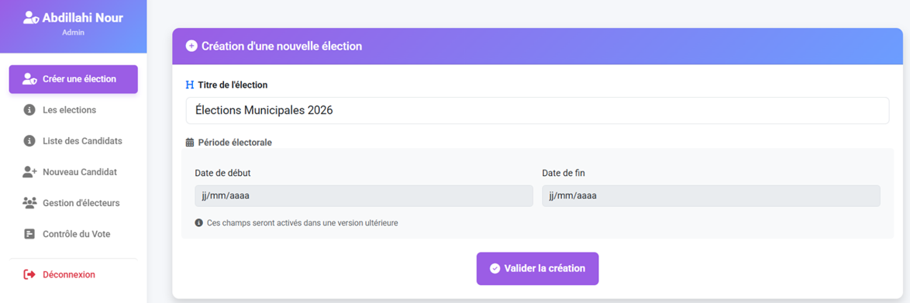
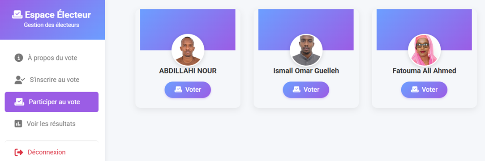
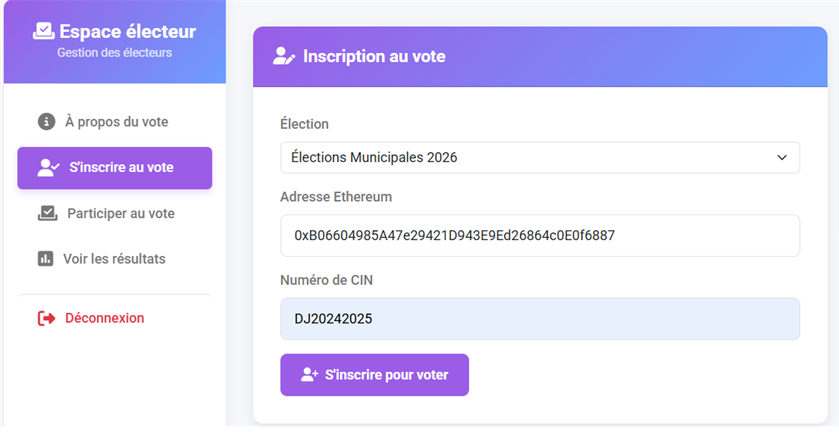

# Plateforme de vote en ligne avec Blockchain

Ce projet est une application web de vote sécurisé utilisant la technologie de la blockchain.
Il a été réalisé dans le cadre de mon projet de fin d'études.
## 🖼️ Captures d'écran

### Voter – Période de vote terminée

### Espace Admin

### Espace Électeur

### Inscription de l’électeur à une élection

## ⚙️ Fonctionnalités

- Authentification (Admin, Électeur, Candidat)
- Création et gestion d’élections
- Vote sécurisé et traçable sur la blockchain
- Affichage des résultats 

